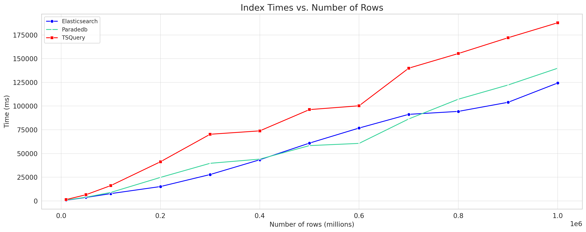
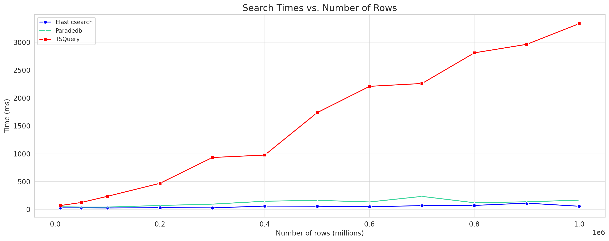

# ParadeDB Benchmarks

This folder contains the results and scripts for benchmarking ParadeDB against other search engines and databases. Currently, the following systems are benchmarked:

- [x] ParadeDB
- [x] PostgreSQL tsquery/tsvector
- [x] ElasticSearch

If you'd like to see benchmarks against another system, please open an issue or a pull request.

## Results

### Experimental Setup

The benchmarks below were run on the following hardware and software:

```bash
# VM
# See here for full details: https://learn.microsoft.com/en-us/azure/virtual-machines/dasv5-dadsv5-series
VM Type: GitHub Actions Large Runner ubuntu-latest-m (Azure Standard_D4ads_v5)

# Image
# See here for full details: https://github.com/actions/runner-images/blob/main/images/linux/Ubuntu2204-Readme.md
OS Version: 22.04.3 LTS
Kernel Version: 6.2.0-1012-azure

# CPU
vCPUs: 4
CPU: AMD 3rd Generation EPYC 7763v 64-Core Processor
CPU MHz: 2693.965
Cache size: 512 KB
Bogomips: 4890.86
TLB size: 2560 4K pages
Clflush size: 64
Cache_alignment: 64
Address sizes: 48 bits physical, 48 bits virtual

# Memory
RAM: 16 GiB
Storage: 150 GiB SSD
Max Data Disks: 8
Max temp storage throughput: 19000 / 250 IOPS/MBps
Max uncached disk throughput: 6400 / 144 IOPS/MBps
Max burst uncached disk throughput: 20000 / 600 IOPS/MBps

# Network
Max NICs: 2
Max network bandwidth: 12500 Mbps
```

The system is warmed up by booting, with no other warmup steps taken. The system is started cold as a new GitHub Actions Large Runner instance each time.

The dataset used is a [snapshot of the Wikipedia English corpus](https://www.dropbox.com/s/wwnfnu441w1ec9p/wiki-articles.json.bz2), with 5,032,105 entries composed of the URL, title, and body, formatted as a JSON file. The dataset is 8.89 GB in size.

The query used for benchmarking is a simple search of the word "Canada" across any field. More benchmark queries will be added in the future, with varying degrees of complexity.

The versions of the systems used for benchmarking are:

- ParadeDB: 0.2.18
- PostgreSQL: 15.4
- ElasticSearch: 8.9.2
- Typesense: 0.25.1

For any questions, clarifications, or suggestions regarding our benchmarking experimental setup, please open a GitHub issue or come chat with us in the [ParadeDB Community Slack](https://join.slack.com/t/paradedbcommunity/shared_invite/zt-217mordsh-ielS6BiZf7VW3rqKBFgAlQ).

### pg_bm25





## Generating Benchmarks

To generate new benchmarks, simply run the relevant Bash script:

```bash
./benchmark-<SYSTEM-TO-BENCHMARK>.sh
```

The results of the benchmarks will be written to a `.csv` file in the `out/` folder.
