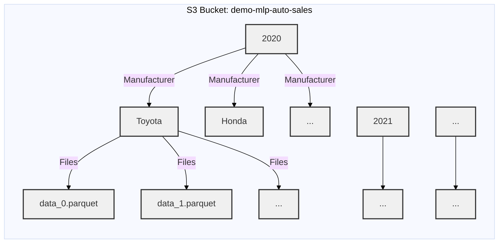
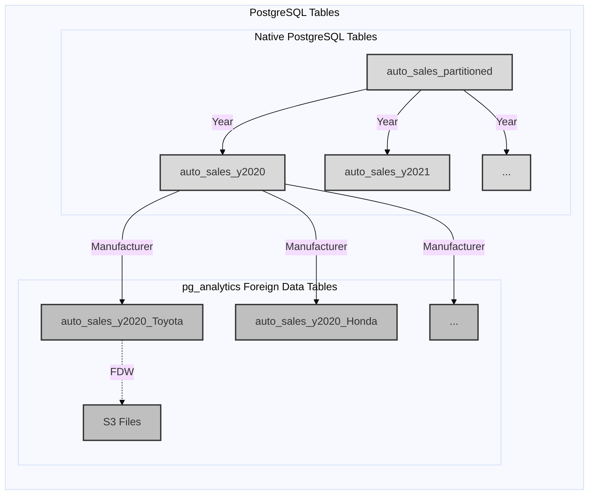
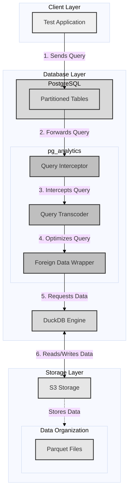

## Introduction

Multi-Level Partitioned (MLP) tables, a feature of the `pg_analytics` extension for PostgreSQL, enable efficient querying of vast datasets stored in cloud storage (like S3) without complex ETL processes. This guide demonstrates how to leverage MLP tables using an [auto sales dataset example](https://github.com/shamb0/pg_analytics/blob/06f0b363c9da3117b08a31d542a662adbadcdf6b/tests/test_mlp_auto_sales.rs).

## Concept and Structure

MLP tables divide large datasets into smaller, manageable partitions organized hierarchically. In our example:

1. First level: Partitioned by year
2. Second level: Partitioned by manufacturer

This creates a structure like:





## Key Benefits

1. **Efficient Querying**: Access only relevant data partitions, improving query performance.
2. **Seamless Integration**: Query S3 data through familiar PostgreSQL interface.
3. **Scalability**: Maintain performance as data grows from gigabytes to terabytes.
4. **Flexible Data Management**: Easily manage partitions for specific years or manufacturers.
5. **Parallel Processing**: Query different partitions simultaneously for faster analysis.
6. **Simplified Maintenance**: Perform operations on specific partitions without affecting the entire dataset.

## What You'll Learn

- Setting up multi-level partitioned tables in PostgreSQL
- Connecting these tables to S3-stored data
- Performing efficient queries on partitioned data

By the end of this guide, you'll be able to harness the power of your data lake directly through SQL, combining the scalability of cloud storage with the flexibility of PostgreSQL.

## Brief overview of the System Components

Our multi-level partitioned table system comprises several key components that work together to provide efficient data storage and querying capabilities. Here's an overview of each component and how they're utilized in our test cases:

### System Components

1. PostgreSQL:

   - Acts as the primary database system
   - Stores the structure of the partitioned tables
   - Handles user queries and interactions

2. S3 Storage:

   - Stores the actual data in Parquet file format
   - Organizes data into a hierarchical structure (year/manufacturer)
   - Provides scalable and cost-effective storage for large datasets

3. `pg_analytics` Foreign Data Wrapper (FDW):

   - Bridges PostgreSQL and S3 storage
   - Manages the connection between PostgreSQL tables and S3 data
   - Intercepts and optimizes queries to partitioned tables

4. DuckDB:
   - In-memory analytics engine used by `pg_analytics`
   - Processes data from S3 efficiently
   - Helps in query optimization and execution



### Core Functionalities of `pg_analytics`

1. **Foreign Data Wrapper (FDW) Management**: Extends PostgreSQL to interact with S3-stored Parquet files.

2. **Multi-level Partition Management**: Creates and manages partitioned tables across different levels (year, manufacturer).

3. **Query Interception and Optimization**:

   - Intercepts queries for partitioned tables
   - Transcodes PostgreSQL queries to DuckDB syntax
   - Optimizes queries for efficient execution on S3 data

4. **Transparent Integration**: Enables querying of partitioned S3 data using standard PostgreSQL syntax.

## Demo Setup and Implementation Details

Our demo application, implemented using core structs `AutoSale`, `AutoSalesSimulator`, and `AutoSalesTestRunner`, demonstrates the functionality and performance of the multi-level partitioned table system. The setup process involves several key steps:

### 1. Data Generation and Organization

#### 1.1 Local Data Generation

```rust
AutoSalesSimulator::save_to_parquet_in_batches(10000, 1000, &parquet_path)
```

This function generates sample auto sales data and saves it to local Parquet files.

#### 1.2 Data Upload and S3 Organization

```rust
pub async fn create_partition_and_upload_to_s3(
    s3: &S3,
    s3_bucket: &str,
    df_sales_data: &DataFrame,
) -> Result<()> {
    // Organizes and uploads data to S3 in a partitioned structure
}
```

This function uploads the data to S3, organizing it to match the PostgreSQL partition structure for efficient querying.

### 2. Database Setup

```rust
AutoSalesTestRunner::setup_tables(&mut conn, &s3, s3_bucket).await?;
```

This function creates the partitioned table structure in PostgreSQL and sets up Foreign Data Wrapper (FDW) connections.

#### 2.1 Foreign Data Wrapper (FDW) Management

`pg_analytics` extends PostgreSQL's FDW capabilities to work with S3 and Parquet files:

```rust
fn setup_s3_fdw(s3_endpoint: &str) -> String {
    format!(
        r#"
        CREATE FOREIGN DATA WRAPPER parquet_wrapper
            HANDLER parquet_fdw_handler
            VALIDATOR parquet_fdw_validator;
        CREATE SERVER auto_sales_server
            FOREIGN DATA WRAPPER parquet_wrapper;
        CREATE USER MAPPING FOR public
            SERVER auto_sales_server
            OPTIONS (
                type 'S3',
                region 'us-east-1',
                endpoint '{s3_endpoint}',
                use_ssl 'false',
                url_style 'path'
            );
        "#
    )
}
```

This function generates SQL commands to set up the necessary FDW components, connecting PostgreSQL with S3.

#### 2.2 Partition Creation and Management

The partitioned table structure is managed through the following functions, which generate SQL commands for different partition levels:

- **Root Partition Table**: Creates the main partitioned table.
- **Year Partition**: Creates a partition for a specific year.
- **Manufacturer Partition**: Creates a foreign table partition for a specific manufacturer within a year.

```rust
fn create_partitioned_table() -> String {
    // Creates the root partitioned table
}

fn create_year_partition(year: i32) -> String {
    // Creates a partition for a specific year
}

fn create_manufacturer_partition(s3_bucket: &str, year: i32, manufacturer: &str) -> String {
    // Creates a foreign table partition for a specific manufacturer within a year
}
```

For a deeper understanding of the partitioned table structure and its workings, please refer to the section [Partitioned Table Structure and S3 Integration](#partitioned-table-structure-and-s3-integration).

### 3. Test Cases

The demo includes several test cases to validate the system's functionality:

#### 3.1 Total Sales Assertion

```rust
AutoSalesTestRunner::assert_total_sales(&mut conn, &df_sales_data).await?;
```

Compares total sales calculations between PostgreSQL and DataFrame.

#### 3.2 Average Price Assertion

```rust
AutoSalesTestRunner::assert_avg_price(&mut conn, &df_sales_data).await?;
```

Verifies average price calculations for a specific year.

#### 3.3 Monthly Sales Assertion

```rust
AutoSalesTestRunner::assert_monthly_sales(&mut conn, &df_sales_data).await?;
```

Ensures accurate monthly sales counts and sale ID collection.

These test cases validate:

- Correct setup of the multi-level partitioned table structure
- Proper data storage and accessibility
- Accurate query results
- Performance comparability between `pg_analytics` queries and direct DataFrame operations

## Partitioned Table Structure and S3 Integration

Our multi-level partitioned table system uses a combination of PostgreSQL's native partitioning and foreign tables to efficiently query data stored in S3. Here's a breakdown of the structure:

1. Root Partitioned Table

   ```sql
   CREATE TABLE auto_sales_partitioned (
       /* column definitions */
   ) PARTITION BY LIST (year);
   ```

   This is a regular PostgreSQL partitioned table that serves as the entry point for queries.

2. Year-Level Partitions

   ```sql
   CREATE TABLE auto_sales_y{year}
   PARTITION OF auto_sales_partitioned
   FOR VALUES IN ({year})
   PARTITION BY LIST (manufacturer);
   ```

   These are PostgreSQL partitions of the root table, further partitioned by manufacturer.

3. Manufacturer-Level Foreign Tables
   ```sql
   CREATE FOREIGN TABLE auto_sales_y{year}_{manufacturer}
   PARTITION OF auto_sales_y{year}
   FOR VALUES IN ('{manufacturer}')
   SERVER auto_sales_server
   OPTIONS (
       files 's3://{s3_bucket}/{year}/{manufacturer}/*.parquet'
   );
   ```
   These are foreign tables that directly link to the Parquet files in S3.

### Key Points:

- The root and year-level partitions are regular PostgreSQL tables, allowing for standard PostgreSQL partition pruning.
- Only the leaf nodes (manufacturer-level) are foreign tables.
- We use the partition keys (year and manufacturer) in the foreign table definition to point to the correct S3 path.

### How It Works:

1. When a query is made against `auto_sales_partitioned`, PostgreSQL uses its partition pruning to determine which year partition(s) to access.
2. It then further prunes to the relevant manufacturer partition(s).
3. When it reaches a leaf node, it encounters the foreign table.
4. The foreign table definition uses the partition keys in its `OPTIONS` clause to construct the correct S3 path.
5. `pg_analytics` then uses this information to query only the relevant Parquet files in S3.

This structure allows us to leverage PostgreSQL's efficient partitioning and pruning capabilities while still maintaining the flexibility of storing data in S3. It enables querying specific subsets of data without scanning unnecessary files, significantly improving query performance on large datasets.

## Launching the Demo App

### Prerequisites

- Install `pg_analytics` following the instructions in the [ParadeDB Documentation](https://docs.paradedb.com/deploy/pg_analytics).

### Running the Demo

1. Clone the repository:
   ```bash
   git clone https://github.com/paradedb/pg_analytics.git
   ```
2. Navigate to the root folder of the cloned repository:
   ```bash
   cd pg_analytics
   ```
3. Execute the following command in your terminal:
   ```bash
   RUST_LOG=info cargo test --test test_mlp_auto_sales -- --nocapture
   ```

This command runs the multi-level partitioned auto sales test with detailed logging, displaying all output.

## Conclusion

The multi-level partitioned table feature in `pg_analytics` demonstrates a powerful approach to managing large datasets efficiently. By leveraging PostgreSQL's familiar interface, DuckDB's analytical capabilities, and S3 storage, it offers:

- Improved query performance on large, partitioned datasets
- Seamless integration with existing PostgreSQL workflows
- Efficient data management and organization in cloud storage

This demo showcases the potential for enhancing data analytics workflows in scenarios requiring fast access to specific subsets of large datasets, such as time-series or categorized data.

For specific questions about this feature or running the test application, please contact the [ParadeDB team](mailto:hello@paradedb.com). For general inquiries and community discussions, join the [ParadeDB Slack](https://join.slack.com/t/paradedbcommunity/shared_invite/zt-2lkzdsetw-OiIgbyFeiibd1DG~6wFgTQ).
