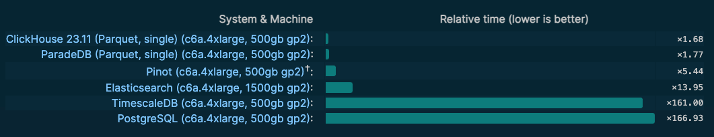

<h1 align="center">
  
<br>
</h1>

## Overview

`pg_analytics` is an extension that transforms Postgres into a very fast analytical database. Query speeds are comparable to those of dedicated OLAP databases like Clickhouse — without the need to leave Postgres.

The primary dependencies are:

- [x] [Apache Arrow](https://github.com/apache/arrow) for column-oriented memory format
- [x] [Apache Datafusion](https://github.com/apache/arrow-datafusion) for vectorized query execution with SIMD
- [x] [Apache Parquet](https://github.com/apache/parquet-mr/) for persistence
- [x] [Delta Lake](https://github.com/delta-io/delta-rs) as a storage framework with ACID properties
- [x] [pgrx](https://github.com/pgcentralfoundation/pgrx), the framework for creating Postgres extensions in Rust

## Benchmarks

On [Clickbench](https://github.com/ClickHouse/ClickBench), ParadeDB is the fastest Postgres-based analytical
database. It's 94x faster than regular Postgres, 8x faster than ElasticSearch, and almost ties Clickhouse.



These benchmarks were run on a c6a.4xlarge with 500GB storage. None of the databases were tuned or
used partitioned Parquet storage (applicable only to ParadeDB and Clickhouse). ParadeDB Clickbench results
have not yet been published to the live site but will be soon.

## Getting Started

This toy example demonstrates how to get started.

```sql
CREATE EXTENSION pg_analytics;
-- This needs to be run once per connection
CALL paradedb.init();
-- Create a deltalake table
CREATE TABLE t (a int) USING deltalake;
-- pg_analytics supercharges the performance of any
-- Postgres query run on a deltalake table
INSERT INTO t VALUES (1), (2), (3);
SELECT COUNT(*) FROM t;
-- This bin packs small Parquet files for optimal compression
VACUUM FULL t;
```

## Roadmap

`pg_analytics` is currently in beta.

### Features Supported

- [x] `deltalake` tables behave like regular Postgres tables and support most Postgres queries (JOINs, CTEs, window functions, etc.)
- [x] DML operations (i.e. update, delete, truncate)
- [x] Vacuum and Parquet storage optimization

### Known Limitations

As `pg_analytics` becomes production-ready, many of these will be resolved.

- [ ] Referencing `deltalake` and regular Postgres `heap` tables in the same query
- [ ] User-defined functions, aggregations, or types
- [ ] Partitioned tables
- [ ] Some Postgres types like arrays, JSON, time, and timestamp with time zone
- [ ] Write-ahead-log (WAL) support and `ROLLBACK`
- [ ] Foreign keys
- [ ] Index scans
- [ ] `TEMP` tables
- [ ] Using an external data lake as a table storage provider
- [ ] Full text search over `deltalake` tables with `pg_bm25`

## How It Works

`pg_analytics` introduces column-oriented storage and vectorized query execution to Postgres via Apache Parquet, Arrow, and Datafusion. These libraries are the building blocks of many modern analytical databases.

### Column-Oriented Storage

Regular Postgres tables, known as heap tables, organize data by row. While this makes sense for operational data, it means that analytics queries over large tables require separate reads of every row, which is expensive. As a result, most dedicated analytics (i.e. OLAP) databases organize data by column such that a single read can see many rows at once.

### Vectorized Query Execution

Vectorized query execution is a technique that takes advantage of modern CPUs to break column-oriented data into batches and process the batches in parallel.

### Postgres Integration

`pg_analytics` embeds Arrow, Parquet, and Datafusion inside Postgres via executor hooks and the table access method API. Executor hooks intercept queries to these tables and reroute them to Datafusion, which creates an optimal query plan, executes the query, and sends the results back to Postgres. The table access method persists Postgres tables as Parquet files and registers them with Postgres' system catalogs. The Parquet files are managed by Delta Lake, which provides ACID transactions.

## Development

### Install Rust

To develop the extension, first install Rust v1.73.0 using `rustup`. We will soon make the extension compatible with newer versions of Rust:

```bash
curl --proto '=https' --tlsv1.2 -sSf https://sh.rustup.rs | sh
rustup install 1.73.0

# We recommend setting the default version for consistency
rustup default 1.73.0
```

Note: While it is possible to install Rust via your package manager, we recommend using `rustup` as we've observed inconcistencies with Homebrew's Rust installation on macOS.

Then, install the PostgreSQL version of your choice using your system package manager. Here we provide the commands for the default PostgreSQL version used by this project:

### Install Postgres

```bash
# macOS
brew install postgresql@15

# Ubuntu
wget --quiet -O - https://www.postgresql.org/media/keys/ACCC4CF8.asc | sudo apt-key add -
sudo sh -c 'echo "deb http://apt.postgresql.org/pub/repos/apt/ $(lsb_release -cs)-pgdg main" > /etc/apt/sources.list.d/pgdg.list'
sudo apt-get update && sudo apt-get install -y postgresql-$15 postgresql-server-dev-15
```

If you are using Postgres.app to manage your macOS PostgreSQL, you'll need to add the `pg_config` binary to your path before continuing:

```bash
export PATH="$PATH:/Applications/Postgres.app/Contents/Versions/latest/bin"
```

### Install pgrx

Then, install and initialize `pgrx`:

```bash
# Note: Replace --pg15 with your version of Postgres, if different (i.e. --pg16, --pg14, etc.)
cargo install --locked cargo-pgrx --version 0.11.1
cargo pgrx init --pg15=`which pg_config`
```

### Configure Shared Preload Libraries

This extension uses Postgres hooks to intercept Postgres queries. In order to enable these hooks, the extension
must be added to `shared_preload_libraries` inside `postgresql.conf`. If you are using Postgres 15, this file can be found under `~/.pgrx/data-15`.

```bash
# Inside postgresql.conf
shared_preload_libraries = 'pg_analytics'
```

### Run Without Optimized Build

The extension can be developed with or without an optimized build. An optimized build improves query times by 10-20x but also significantly increases build times.

To launch the extension without an optimized build, run

```bash
cargo pgrx run
```

### Run With Optimized Build

First, switch to latest Rust Nightly (as of writing, 1.77) via:

```bash
rustup update nightly
rustup override set nightly
```

Then, reinstall `pgrx` for the new version of Rust:

```bash
cargo install --locked cargo-pgrx --version 0.11.1 --force
```

Finally, run to build in release mode with SIMD:

```bash
cargo pgrx run --features simd --release
```

Note that this may take several minutes to execute.

To revert back to the stable version of Rust, run:

```bash
rustup override unset
```

### Run Benchmarks

To run benchmarks locally, enter the `pg_analytics/` directory and run `cargo clickbench`. This runs a minified version of the ClickBench benchmark suite on `pg_analytics`.
