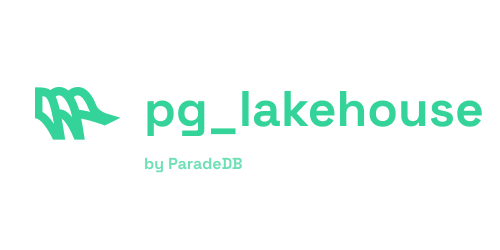

<h1 align="center">
  
<br>
</h1>

## Overview

`pg_lakehouse` is an extension that transforms Postgres into an analytical query engine over object stores like S3 and table formats like Apache Iceberg. Queries are pushed down to [Apache DataFusion](https://github.com/apache/datafusion), which delivers excellent analytical performance. Combinations of the following object stores, table formats, and file formats are supported.

### Object Stores

- [x] Amazon S3
- [x] S3-compatible object stores (e.g. MinIO)
- [x] Local file system
- [ ] Google Cloud Storage (coming soon)
- [ ] Azure Blob Storage (coming soon)

...and potentially any service supported by [Apache OpenDAL](https://opendal.apache.org/docs/category/services). See the Development section for instructions on how to [add a service](#adding-a-service).

### File Formats

- [x] Parquet
- [x] CSV
- [x] JSON
- [x] Avro
- [ ] ORC (coming soon)

### Table Formats

- [x] Delta Lake
- [ ] Apache Iceberg (coming soon)

`pg_lakehouse` is supported on Postgres 14, 15, and 16. Support for Postgres 12 and 13 is coming soon.

## Motivation

Today, a vast amount of non-operational data — events, metrics, historical snapshots, vendor data, etc. — is ingested into data lakes like S3. Querying this data by moving it into a cloud data warehouse or operating a new query engine is expensive and time consuming. The goal of `pg_lakehouse` is to enable this data to be queried directly from Postgres. This eliminates the need for new infrastructure, loss of data freshness, data movement, and non-Postgres dialects of other query engines.

`pg_lakehouse` uses the foreign data wrapper (FDW) API to connect to any object store or table format and the executor hook API to push queries to DataFusion. While other FDWs like `aws_s3` have existed in the Postgres extension ecosystem, these FDWs suffer from two limitations:

1. Lack of support for most object stores, file, and table formats
2. Too slow over large datasets to be a viable analytical engine

`pg_lakehouse` differentiates itself by supporting a wide breadth of stores and formats (thanks to [OpenDAL](https://github.com/apache/opendal)) and by being very fast (thanks to [DataFusion](https://github.com/apache/datafusion)).

## Getting Started

The following example uses `pg_lakehouse` to query an example dataset of 3 million NYC taxi trips from January 2024, hosted in a public S3 bucket provided by ParadeDB.

```sql
CREATE EXTENSION pg_lakehouse;
CREATE FOREIGN DATA WRAPPER s3_wrapper HANDLER s3_fdw_handler VALIDATOR s3_fdw_validator;

-- Provide S3 credentials
CREATE SERVER s3_server FOREIGN DATA WRAPPER s3_wrapper
OPTIONS (bucket 'paradedb-benchmarks', region 'us-east-1', allow_anonymous 'true');

-- Create foreign table
CREATE FOREIGN TABLE trips (
    "VendorID"              INT,
    "tpep_pickup_datetime"  TIMESTAMP,
    "tpep_dropoff_datetime" TIMESTAMP,
    "passenger_count"       BIGINT,
    "trip_distance"         DOUBLE PRECISION,
    "RatecodeID"            DOUBLE PRECISION,
    "store_and_fwd_flag"    TEXT,
    "PULocationID"          REAL,
    "DOLocationID"          REAL,
    "payment_type"          DOUBLE PRECISION,
    "fare_amount"           DOUBLE PRECISION,
    "extra"                 DOUBLE PRECISION,
    "mta_tax"               DOUBLE PRECISION,
    "tip_amount"            DOUBLE PRECISION,
    "tolls_amount"          DOUBLE PRECISION,
    "improvement_surcharge" DOUBLE PRECISION,
    "total_amount"          DOUBLE PRECISION
)
SERVER s3_server
OPTIONS (path 's3://paradedb-benchmarks/yellow_tripdata_2024-01.parquet', extension 'parquet');

-- Success! Now you can query the remote Parquet file like a regular Postgres table
SELECT COUNT(*) FROM trips;
  count
---------
 2964624
(1 row)
```

Note that column names must be wrapped in double quotes to preserve uppercase letters. This is because DataFusion is case-sensitive and Postgres' foreign table column names must match the foreign table's column names exactly.

## Query Acceleration

This extension uses Postgres hooks to intercept and push queries down to DataFusion. In order to enable these hooks, the extension
must be added to `shared_preload_libraries` inside `postgresql.conf`. If you are using Postgres 16, this file can be found under `~/.pgrx/data-16`.

```bash
# Inside postgresql.conf
shared_preload_libraries = 'pg_lakehouse'
```

## Inspecting the Foreign Schema

The `arrow_schema` function displays the schema of a foreign table. This function is useful for verifying that the server and table credentials you've provided are valid. If the connection is successful and `pg_lakehouse` is able to read the foreign data, a table will be returned with the [Arrow schema](https://docs.rs/datafusion/latest/datafusion/common/arrow/datatypes/enum.DataType.html) of the foreign table. Otherwise, an empty table will be returned or an error will be thrown.

```sql
SELECT * FROM arrow_schema(
  server => 's3_server',
  path => 's3://paradedb-benchmarks/yellow_tripdata_2024-01.parquet',
  extension => 'parquet'
);
```

You can also use this function to decide what Postgres types to assign to each column of the foreign table. For instance, an Arrow `Utf8` datatype should map to a Postgres `TEXT`, `VARCHAR`, or `BPCHAR` column. If an incompatible Postgres type is chosen, querying the table will fail.

## S3

This code block demonstrates how to create a foreign table over S3 or an S3-compatible object
store.

```sql
CREATE FOREIGN DATA WRAPPER s3_wrapper HANDLER s3_fdw_handler VALIDATOR s3_fdw_validator;
CREATE SERVER s3_server FOREIGN DATA WRAPPER s3_wrapper
OPTIONS (
    bucket 'bucket_name'
    region 'us-east-1',
    allow_anonymous 'true'
);

-- Replace the dummy schema with the actual schema of your file data
CREATE FOREIGN TABLE local_file_table ("x" INT)
SERVER s3_server
OPTIONS (path 's3://path/to/file.parquet', extension 'parquet');
```

### S3 Server Options

- `bucket`: Name of the S3 bucket. Required for all object stores.
- `region`: AWS region, e.g. `us-east-1`. Required for Amazon S3, MinIO, Scaleway, and Cloudflare R2.
- `endpoint`: The endpoint for communicating with the S3 instance. Defaults to the [region endpoint](https://docs.aws.amazon.com/general/latest/gr/s3.html). For example, can be set to `http://localhost:4566` if testing against a Localstack instance, or `http://127.0.0.1:9000` for MinIO. Required for all non Amazon S3 object stores.
- `allow_anonymous`: If set to `true`, will not sign requests. This is useful for connecting to public S3 buckets. Defaults to `false`.
- `root`: Working directory for the backend.

### S3 Table Options

- `path` (required): Must start with `s3://` and point to the location of your file. The path should end in a `/` if it points to a directory of partitioned Parquet files.
- `extension` (required): One of `avro`, `csv`, `json`, and `parquet`.
- `format`: Only `delta` is supported for now. If omitted, `pg_lakehouse` assumes that no table format is used.

### S3 Credentials

`CREATE USER MAPPING` is used to pass in credentials for private buckets.

```sql
-- Get the name of the current user
SELECT current_user;
 current_user
--------------
 myuser

-- Run this before CREATE FOREIGN TABLE
CREATE USER MAPPING FOR myuser
SERVER s3_server
OPTIONS (
  access_key_id 'XXXXXX',
  secret_access_key 'XXXXXX'
);

-- Now, run CREATE FOREIGN TABLE
```

Note: To make credentials available to all users, you can set the user to `public`. Valid user mapping options are:

- `access_key_id`: AWS access key ID
- `secret_access_key`: AWS secret access key
- `security_token`: Sets the AWS session token

### S3 Compatible Services

In addition to Amazon S3, following S3-compatible object stores are supported:

- [x] Alibaba Object Storage Service
- [x] MinIO
- [x] QingStor Object Storage
- [x] Scaleway Object Storage
- [x] Tencent Cloud Object Storage
- [x] Wasabi Object Storage
- [x] Cloudflare R2

## Local File System

To be queryable, files must exist on the same machine as your Postgres instance.

```sql
CREATE FOREIGN DATA WRAPPER local_file_wrapper HANDLER local_file_fdw_handler VALIDATOR local_file_fdw_validator;
CREATE SERVER local_file_server FOREIGN DATA WRAPPER local_file_wrapper;

-- Replace the dummy schema with the actual schema of your file data
CREATE FOREIGN TABLE local_file_table ("x" INT)
SERVER local_file_server
OPTIONS (path 'file:///path/to/file.parquet', extension 'parquet');
```

### Local File Table Options

- `path` (required): An absolute path starting with `file:///`. The path should end in a `/` if it points to a directory of partitioned Parquet files.
- `extension` (required): One of `avro`, `csv`, `json`, and `parquet`.
- `format`: Only `delta` is accepted for the Delta Lake format. If omitted, no table format is assumed.

## Datetime Types

Datetime fields are often stored as integers representing the number of days, seconds, milliseconds, etc. since the UNIX epoch (January 1, 1970). When converting these fields to Postgres datetime types, the precision of these integers must be accounted for in order to convert them
to the correct datetime value.

### Date

`pg_lakehouse` provides a `to_date` function that converts an integer representing the number of days elapsed since the UNIX epoch (January 1, 1970) to a Postgres `DATE` type.

```sql
CREATE FOREIGN TABLE hits (
  "EventDate" INTEGER
) USING foreign_server OPTIONS (...);

SELECT to_date("EventDate") FROM hits LIMIT 1;
```

### Timestamp

Similarly, the `to_timestamp` function converts an integer representing the number of seconds elapsed since the UNIX epoch to a Postgres `TIMESTAMP` type.

```sql
CREATE FOREIGN TABLE hits (
  "EventTime" BIGINT
) USING foreign_server OPTIONS (...);

SELECT to_timestamp("EventTime") FROM hits LIMIT 1;
```

## Development

### Install Rust

To develop the extension, first install Rust via `rustup`.

```bash
curl --proto '=https' --tlsv1.2 -sSf https://sh.rustup.rs | sh
rustup install <version>

rustup default <version>
```

Note: While it is possible to install Rust via your package manager, we recommend using `rustup` as we've observed inconcistencies with Homebrew's Rust installation on macOS.

Then, install the PostgreSQL version of your choice using your system package manager. Here we provide the commands for the default PostgreSQL version used by this project:

### Install Postgres

```bash
# macOS
brew install postgresql@16

# Ubuntu
wget --quiet -O - https://www.postgresql.org/media/keys/ACCC4CF8.asc | sudo apt-key add -
sudo sh -c 'echo "deb http://apt.postgresql.org/pub/repos/apt/ $(lsb_release -cs)-pgdg main" > /etc/apt/sources.list.d/pgdg.list'
sudo apt-get update && sudo apt-get install -y postgresql-16 postgresql-server-dev-16
```

If you are using Postgres.app to manage your macOS PostgreSQL, you'll need to add the `pg_config` binary to your path before continuing:

```bash
export PATH="$PATH:/Applications/Postgres.app/Contents/Versions/latest/bin"
```

### Install pgrx

Then, install and initialize `pgrx`:

```bash
# Note: Replace --pg16 with your version of Postgres, if different (i.e. --pg15, --pg14, etc.)
cargo install --locked cargo-pgrx --version 0.11.3

# macOS arm64
cargo pgrx init --pg16=/opt/homebrew/opt/postgresql@16/bin/pg_config

# macOS amd64
cargo pgrx init --pg16=/usr/local/opt/postgresql@16/bin/pg_config

# Ubuntu
cargo pgrx init --pg16=/usr/lib/postgresql/16/bin/pg_config
```

If you prefer to use a different version of Postgres, update the `--pg` flag accordingly.

Note: While it is possible to develop using pgrx's own Postgres installation(s), via `cargo pgrx init` without specifying a `pg_config` path, we recommend using your system package manager's Postgres as we've observed inconsistent behaviours when using pgrx's.

### Adding a Service

`pg_lakehouse` uses Apache OpenDAL to integrate with various object stores. As of the time of writing, some — but not all — of the object stores supported by OpenDAL have been integrated.

Adding support for a new object store is as straightforward as

1. Adding the service feature to `opendal` in `Cargo.toml`. For instance, S3 requires `services-s3`.
2. Creating a file in the `fdw/` folder that implements the `BaseFdw` trait. For instance, `fdw/s3.rs` implements the S3 FDW.
3. Registering the FDW in `fdw/handler.rs`.
