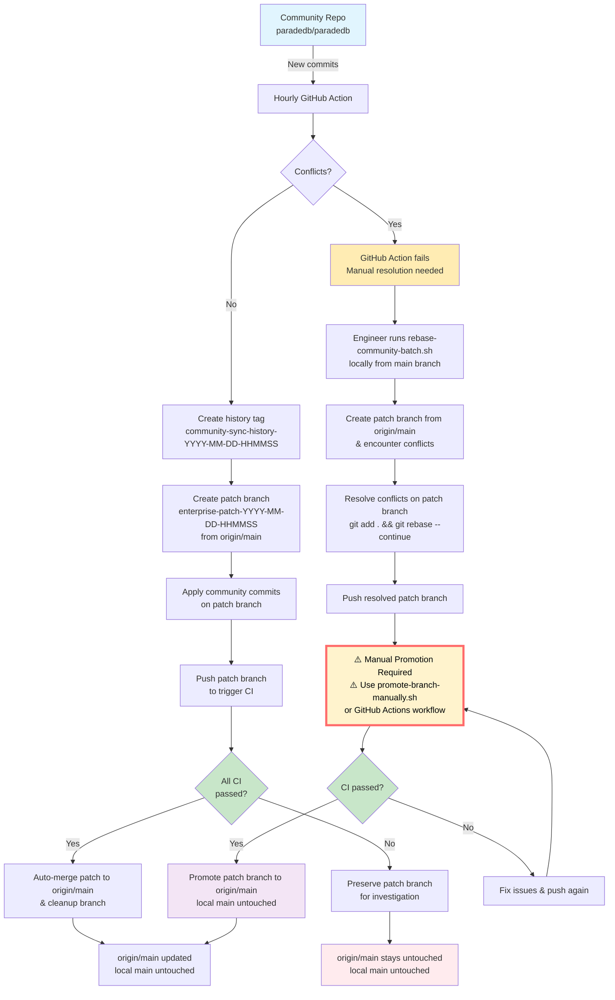

# Scripts

## Community Sync

Scripts to help sync community commits into the enterprise repository.
All scripts include `--help` for usage details.

This document illustrates the ParadeDB community sync process that keeps the enterprise repository synchronized with community updates.

## Workflow Diagram



## Scripts Overview

### `rebase-community-batch.sh`

Entry point for community sync operations.

- ⚠️ **This script is automatically run by GitHub Actions every hour** - Only run locally if GitHub Actions fails and prompts you to do so!
- **Local main branch is never touched or modified** - All work happens on patch branches created from `origin/main`
- Creates patch branch from `origin/main` (not local main)
- Applies multiple community commits in batch on the patch branch
- Creates tags anytime it is running a rebase. This helps preserving git history in case manual review is needed
- **Automated CI Validation**: Pushes patch branch to trigger native GitHub CI, polls for completion, and auto-merges to `origin/main` when CI passes
- **Conflict Resolution**: Leaves patch branch with conflicts for manual resolution when needed
- After successful completion, you'll be on a detached HEAD at `origin/main`. Run `git checkout main && git pull` to sync your local main
- Use `--dry-run` to preview changes

```text
Usage: ./scripts/rebase-community-batch.sh [OPTIONS]

Community rebase script that applies multiple commits with CI validation.

Options:
  --max-commits N       Maximum number of commits to process (default: 5)
  --skip-validation     Skip CI validation step
  --dry-run            Show what would be done without making changes
  --debug              Enable debug logging
  -h, --help           Show this help message

Examples:
  ./scripts/rebase-community-batch.sh                              # Apply up to 5 commits
  ./scripts/rebase-community-batch.sh --max-commits 5              # Apply up to 5 commits
  ./scripts/rebase-community-batch.sh --dry-run --max-commits 3    # Preview up to 3 commits
  ./scripts/rebase-community-batch.sh --skip-validation            # Skip CI validation
```

## Normal Operations

Community sync operations are **automated via GitHub Actions** (`.github/workflows/community-rebase.yml`), which runs every hour.

**Manual execution is only needed if the GitHub Action fails** and explicitly asks you to resolve conflicts locally. In that case, see the [Conflict Resolution Workflow](#conflict-resolution-workflow) section below.

## Conflict Resolution Workflow

If a conflict occurs during the GitHub Action, it will preserve the patch branch and ask you to resolve conflicts manually:

```bash
# Run the batch script manually (must be on main branch to start)
# The script will create a patch branch from origin/main (not your local main)
./scripts/rebase-community-batch.sh
```

This will create a new patch branch from `origin/main` and encounter the same conflict. You'll be left on the patch branch with conflicts to resolve:

```bash
# Stage resolved files
git add .

# Continue the rebase
git rebase --continue

# Push your resolved patch branch
git push
```

Now you have the resolved commits on the patch branch. To promote this branch to main, use the **manual promotion workflow**:

### `promote-branch-manually.sh`

Branch promotion workflow for manual conflict resolution and enterprise patch management.

- ⚠️ **This script should ONLY be run via GitHub Actions workflow** - Do not run locally!
- Automatically triggered by the "Promote Branch to Main" workflow in GitHub Actions
- **Use Cases**:
  - Promote patch branches after manual conflict resolution
  - Promote enterprise patches that were squashed/split locally
  - Manual promotion when automated workflow fails

## Enterprise Patch Management

If you need to squash or split enterprise patches (commits after the common ancestor with community main), perform the operations locally and use the promote-branch workflow to merge to main:

```bash
# 1. Make your changes locally on main branch
# Examples:
#   - Squash commits: git rebase -i <community-base-commit>
#   - Split commits: git rebase -i <community-base-commit> and use 'edit'
#   - Amend commits: git commit --amend

# 2. Once your local main has the desired commit history, use the promote-branch workflow
# Follow the steps in the "promote-branch-manually.sh" section above:
#   - Step 1: Create enterprise-patch branch via GitHub Actions (leave branch name empty)
#   - Step 2: Push your local main to the created branch
#   - Step 3: Create PR and get approval
#   - Step 4: Promote to main via GitHub Actions
```

> [!NOTE]
> Any modifications to enterprise patches should be done carefully and reviewed thoroughly, as they affect the delta between community and enterprise codebases.

## History & Audit

View historical sync points and rollback if needed:

```bash
# View historical sync points
git tag -l "community-sync-history-*"

# Example: View a specific sync point from above list
git show community-sync-history-2024-01-15-143022
```
